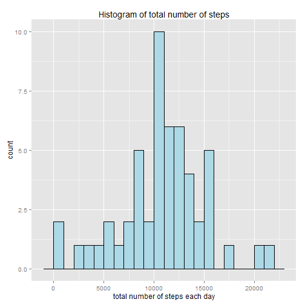
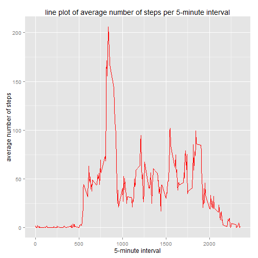
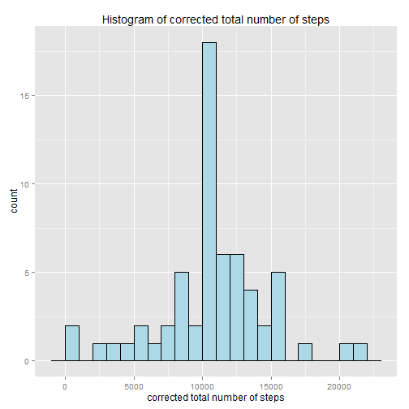
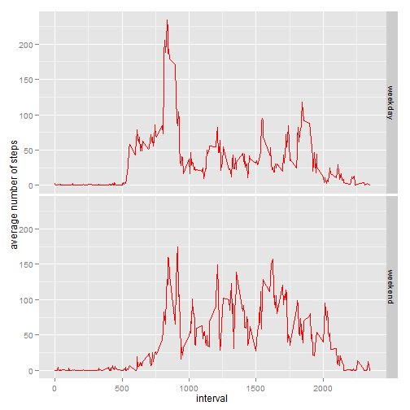

# Reproducible Research: Peer assessment 1

## Loading and preprocessing the data

#### 1. Loading the data into a dataframe


```r
FileUrl <- "http://d396qusza40orc.cloudfront.net/repdata/data/activity.zip"
temp <- tempfile()
download.file(FileUrl,temp,method="auto",mode="wb")
con <- unz(temp,"activity.csv")
Data <- read.csv(con, stringsAsFactors=FALSE)
```

The data are downloaded in a temporary file and unzipped. The extracted csv file is then read into a dataframe called "Data"

#### 2. Process/transform the data

```r
Data$interval <- sprintf("%04d", Data$interval)
Data$datetime <- strptime(paste(Data$date,Data$interval),"%Y-%m-%d %H%M")
Data$steps <- as.numeric(Data$steps)
```

* The interval column is converted to a 4 character string with leading zeros.
* A datetime column is added by concatenating the date and interval column, and converting to a date format.
* The steps column is converted to be numeric.

## What is mean total number of steps taken per day?

For this part of the assignment, you can ignore the missing values in the dataset.

#### 1. Make a histogram of the total number of steps taken each day


```r
library(ggplot2)
x<-tapply(Data$steps,as.factor(Data$date),sum)
qplot(x,xlab = "total number of steps each day", main = "Histogram of total number of steps", binwidth=1000, fill=I("lightblue"), colour=I("black"))
```

 

To create this histogram the steps need to be summed by day. The tapply function is used to obtain this and the result is writen to 'x'.

#### 2. Calculate and report the mean and median total number of steps taken per day


```r
mean_steps <- format(mean(x, na.rm=TRUE),digits=5)
median_steps <- format(median(x, na.rm=TRUE),digits=5)
```

The mean number of steps per day is 10766 and the median number of steps is 10765.

## What is the average daily activity pattern?

#### Make a time series plot (i.e. type = "l") of the 5-minute interval (x-axis) and the average number of steps taken, averaged across all days (y-axis)


```r
library(plyr)
y<-ddply(Data,.(interval),summarize, mean_steps=mean(steps,na.rm=TRUE))
qplot(as.numeric(interval), mean_steps, data = y, geom="line", colour=I("red"), xlab="5-minute interval", ylab="average number of steps", main="line plot of average number of steps per 5-minute interval")
```

 

The mean steps per interval are obtained with the *ddply* function from the *plyr* package.

#### Which 5-minute interval, on average across all the days in the dataset, contains the maximum number of steps?


```r
m <- max(y$mean_steps)
y[y$mean_steps==m,]
```

```
##     interval mean_steps
## 104     0835      206.2
```

Firstly the maximum average number of steps is calculated, which is then used to subset the data.

## Imputing missing values

Note that there are a number of days/intervals where there are missing values (coded as NA). The presence of missing days may introduce bias into some calculations or summaries of the data.

#### 1. Calculate and report the total number of missing values in the dataset (i.e. the total number of rows with NAs)


```r
num_NA_steps<-sum(is.na(Data$steps))
```
total number of rows with NAs = 2304

#### 2. Devise a strategy for filling in all of the missing values in the dataset. The strategy does not need to be sophisticated. For example, you could use the mean/median for that day, or the mean for that 5-minute interval, etc.

We will use for the missing values the average values per 5-minute interval, since this seams to be the best estimator for missing values.

#### 3. Create a new dataset that is equal to the original dataset but with the missing data filled in.


```r
df <- merge(Data,y)
for (i in 1:nrow(df)) {
  if (is.na(df[i,2])) {
    df[i,2]<-df[i,5]
  }
}
summary(df)
```

```
##    interval             steps           date          
##  Length:17568       Min.   :  0.0   Length:17568      
##  Class :character   1st Qu.:  0.0   Class :character  
##  Mode  :character   Median :  0.0   Mode  :character  
##                     Mean   : 37.4                     
##                     3rd Qu.: 27.0                     
##                     Max.   :806.0                     
##     datetime                     mean_steps    
##  Min.   :2012-10-01 00:00:00   Min.   :  0.00  
##  1st Qu.:2012-10-16 05:58:45   1st Qu.:  2.49  
##  Median :2012-10-31 11:57:30   Median : 34.11  
##  Mean   :2012-10-31 11:30:49   Mean   : 37.38  
##  3rd Qu.:2012-11-15 17:56:15   3rd Qu.: 52.83  
##  Max.   :2012-11-30 23:55:00   Max.   :206.17
```

The summary shows that the missing values have disappeared from the data.
This was achieved by merging the original data (*Data*) with the intermediate generated data in *y*. The steps value is overwritten by the mean steps when steps is NA.

#### 4. Make a histogram of the total number of steps taken each day and Calculate and report the mean and median total number of steps taken per day. Do these values differ from the estimates from the first part of the assignment? What is the impact of imputing missing data on the estimates of the total daily number of steps?


```r
x<-tapply(df$steps,as.factor(df$date),sum)
qplot(x,xlab = "corrected total number of steps", main = "Histogram of corrected total number of steps", binwidth=1000, fill=I("lightblue"), colour=I("black"))
```

 

```r
mean(x, na.rm=TRUE)
```

```
## [1] 10766
```

```r
median(x, na.rm=TRUE)
```

```
## [1] 10766
```

Applying the algorthim to the missing data makes the data even more concentrated around the mean.

## Are there differences in activity patterns between weekdays and weekends?

For this part the weekdays() function may be of some help here. Use the dataset with the filled-in missing values for this part.

#### 1. Create a new factor variable in the dataset with two levels - "weekday" and "weekend" indicating whether a given date is a weekday or weekend day.


```r
datetolevel <- function(d) {
  # function works for english and dutch language
  d <- as.Date(d)
  if (weekdays(d) %in% c("zaterdag","zondag","saturday","sunday")) {
    level <- "weekend"
  } else {
    level <- "weekday"
  }
}
Data$fdate<-lapply(Data$date,datetolevel)
Data$fdate<-factor(Data$fdate,levels = c("weekday","weekend"))
summary(Data)
```

```
##      steps           date             interval        
##  Min.   :  0.0   Length:17568       Length:17568      
##  1st Qu.:  0.0   Class :character   Class :character  
##  Median :  0.0   Mode  :character   Mode  :character  
##  Mean   : 37.4                                        
##  3rd Qu.: 12.0                                        
##  Max.   :806.0                                        
##  NA's   :2304                                         
##     datetime                       fdate      
##  Min.   :2012-10-01 00:00:00   weekday:12960  
##  1st Qu.:2012-10-16 05:58:45   weekend: 4608  
##  Median :2012-10-31 11:57:30                  
##  Mean   :2012-10-31 11:30:49                  
##  3rd Qu.:2012-11-15 17:56:15                  
##  Max.   :2012-11-30 23:55:00                  
## 
```

A *datetolevel* function is created to convert a date to a string (level).
The factor variable is added to the dataset using above function.
The summary shows *fdate* is added.

#### 2. Make a panel plot containing a time series plot (i.e. type = "l") of the 5-minute interval (x-axis) and the average number of steps taken, averaged across all weekday days or weekend days (y-axis). 


```r
y<-ddply(Data,.(interval,fdate),summarize, mean_steps=mean(steps,na.rm=TRUE))
qplot(as.numeric(interval), mean_steps, data = y, facets = fdate ~., geom="line", colour=I("red"), xlab="interval", ylab="average number of steps")
```

 

Analysis of the graphs shows:
* During weekdays the peak of steps is in the morning when people go to school, work, ...
* The rest of the day the activity is rather moderate until people go back home, but this happens at different times.
* In the weekend the peak in the morning is less pronounced, but the activity during the day is at a higher level then during weekdays.
